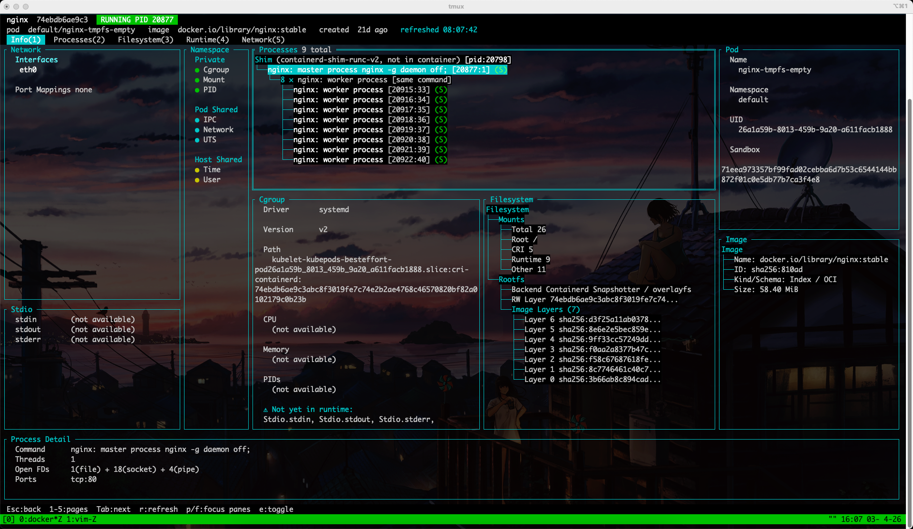
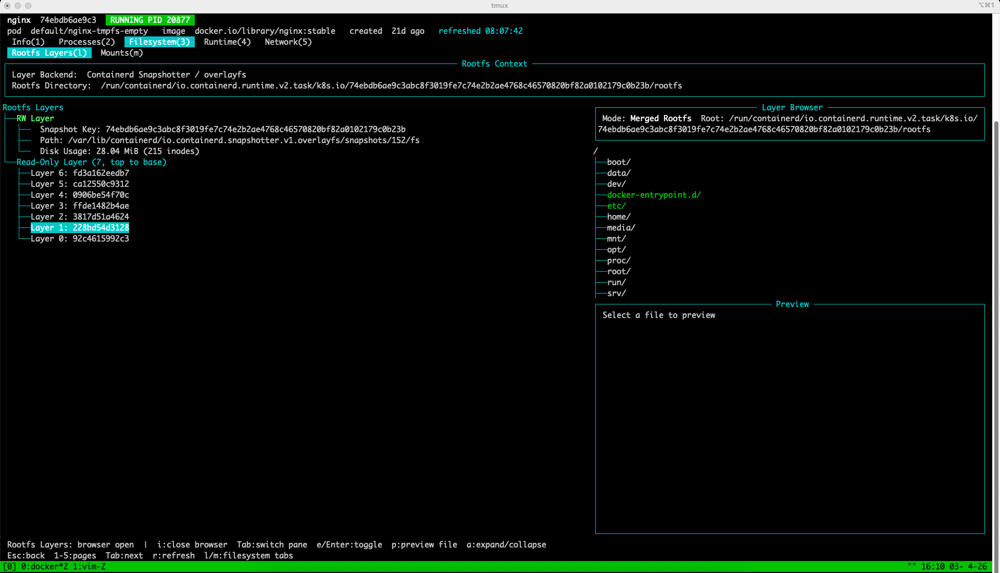

# c-ray

一个容器管理 TUI 工具，提供深度运行时 introspection 能力。支持 **containerd**、**CRI-O**、**Docker**（Classic / containerd image store）以及 **Docker Desktop on macOS**。

## 界面预览

### 容器详情页


### 容器层视图


## 功能特性

### 容器管理
- 📦 **容器列表**: ID、名称、镜像、状态、运行时间、Pod 关联
- 🌲 **容器树形视图**: 层级化展示 Pod 与容器关系
- 📊 **容器详情页**:
  - 基本信息汇总（状态、PID、启动时间、重启次数）
  - 环境变量（支持 Kubernetes 标记）
  - 进程 Top 视图（CPU、内存、RSS 实时监控）
  - 进程树展示（层级进程关系）
  - 进程列表（详细信息）
  - 挂载卷浏览（带来源追踪和状态标记）
  - 镜像层查看（快照、压缩信息、磁盘占用）
  - 网络信息（CNI、DNS、端口映射、多 IP）
  - 运行时信息（OCI 配置、runc 状态、CRI 元数据）
  - 存储信息（可写层、快照使用量）

### 镜像管理
- 🖼️ **镜像列表**: 名称、Digest、大小、创建时间
- 📐 **镜像详情**: 标签、配置信息、内容路径
- 🥞 **镜像层分析**:
  - 分层结构可视化
  - 压缩/未压缩 Digest
  - 快照存储状态
  - 磁盘占用统计
  - 容器层叠加展示

### Pod 管理
- 🎯 **Pod 列表**: 名称、命名空间、UID、容器数量
- 🔗 **Pod 关联**: 容器与 Pod 的双向导航

### 深度运行时 Introspection
- **CRI 元数据集成**: 从 CRI 获取挂载、网络、状态信息
- **挂载来源追踪**:
  - `cri`: CRI 配置的挂载
  - `runtime-default`: 运行时默认挂载
  - `live-extra`: 运行时动态添加的挂载
- **挂载状态**: `declared+live` / `declared-only` / `live-only`
- **CNI 网络详情**: 接口、路由、DNS、端口映射
- **进程资源监控**: CPU 使用率、内存 RSS、内存百分比

## 支持的运行时

c-ray 通过统一抽象层对接多种容器运行时，自动探测可用的 socket 并按以下顺序选择对应后端：CRI-O，支持 CRI 的 containerd，Docker，最后尝试普通 containerd。若全部探测失败，会直接报错，并提示使用 `-socket` 或 `CRAY_SOCKET` 显式指定。

| 运行时 | Socket 路径 | 数据来源 | 说明 |
|--------|------------|---------|------|
| **containerd** | `/run/containerd/containerd.sock` | containerd API + CRI | 原生 containerd，支持 namespace 隔离，适用于 Kubernetes 节点 |
| **CRI-O** | `/run/crio/crio.sock` | containers/storage + CRI | 使用 containers/storage 库直读存储元数据，CRI 补充运行时状态 |
| **Docker (Classic)** | `/var/run/docker.sock` | Docker Engine API | 传统 Docker graphdriver 模式（overlay2 等） |
| **Docker (containerd)** | `/var/run/docker.sock` | Docker Engine API + containerd | 检测到 containerd snapshotter 时自动委托镜像操作给 containerd |
| **Docker Desktop (macOS)** | N/A（通过 launcher 桥接） | Docker Desktop VM 内的 Docker socket | macOS 上通过 launcher 在 Docker 容器内 chroot 执行 Linux 二进制 |

### 运行时详情

#### containerd

原生对接 containerd gRPC API，是 c-ray 最初支持的运行时。通过 Kubernetes CRI 获取 Pod、挂载、网络等元数据，配合 `/proc`、`/sys/fs/cgroup` 等系统文件实现进程和资源监控。

当未显式传入 `-namespace` 或 `CONTAINERD_NAMESPACE` 时，c-ray 会按探测结果自动选择 namespace：

- 支持 CRI 的 containerd：默认 `k8s.io`
- 纯 containerd：默认 `default`

```bash
cray -socket /run/containerd/containerd.sock -namespace k8s.io
```

#### CRI-O

CRI-O 模式以 [containers/storage](https://github.com/containers/storage) 作为主要数据源，直接读取存储后端获取容器、镜像和层的元数据，无需依赖 CRI API 即可获取存储层面的完整信息。CRI API 仅用于补充运行时状态（PID、生命周期、标签、Pod 关联、网络元数据）。

支持 CRI-O 的 split store（`/var/lib/containers/storage` + `/run/containers/storage`）和 transient store 配置。

```bash
cray -socket /run/crio/crio.sock
```

#### Docker

通过 Docker Engine API 管理容器。连接时自动探测镜像存储模式：

- **Classic**：传统 graphdriver（overlay2、btrfs 等），镜像操作通过 Docker API 完成
- **Containerd**：检测到 `io.containerd.snapshotter.v1` 时，镜像操作自动委托给 containerd 后端（Docker Desktop 4.34+ / Docker Engine 29.0+ 默认）

```bash
cray -socket /var/run/docker.sock
```

#### Docker Desktop on macOS

macOS 没有原生 Linux 容器运行时，因此 c-ray 提供了一个 launcher 包装器：

1. launcher 是一个 Darwin 原生二进制，内嵌静态链接的 Linux c-ray 二进制
2. 运行时自动启动一个特权 Docker 容器，将宿主机 `/` 挂载为 `/vm`
3. 将内嵌的二进制复制到 VM 文件系统后通过 `chroot /vm` 执行
4. 在 VM 内按统一策略自动探测可用 socket，通常会解析到 Docker 的 `/var/run/docker.sock`

前置条件：Docker Desktop 必须处于运行状态。

```bash
cray   # macOS 上自动使用 launcher
```

## 安装

### 从 Release 下载

```bash
# Linux AMD64
curl -L -o cray.tar.gz https://github.com/icebergu/c-ray/releases/latest/download/cray-linux-amd64.tar.gz
tar -xzf cray.tar.gz

# Linux ARM64
curl -L -o cray.tar.gz https://github.com/icebergu/c-ray/releases/latest/download/cray-linux-arm64.tar.gz
tar -xzf cray.tar.gz

# macOS Intel
curl -L -o cray.tar.gz https://github.com/icebergu/c-ray/releases/latest/download/cray-darwin-amd64.tar.gz
tar -xzf cray.tar.gz

# macOS Apple Silicon
curl -L -o cray.tar.gz https://github.com/icebergu/c-ray/releases/latest/download/cray-darwin-arm64.tar.gz
tar -xzf cray.tar.gz

# 移动到 PATH
chmod +x cray
sudo mv cray /usr/local/bin/
```

### 从源码构建

```bash
# 克隆仓库
git clone https://github.com/icebergu/c-ray.git
cd c-ray

# 本地构建
make build

# 交叉编译 Linux
GOOS=linux GOARCH=arm64 go build -o bin/cray-linux ./cmd/cray
```

## 使用

### TUI 模式

```bash
# 启动 TUI（默认，自动探测运行时）
cray

# 或显式指定
cray tui

# 自动探测失败时，显式指定 socket
cray -socket /run/containerd/containerd.sock

# 指定 containerd
cray -socket /run/containerd/containerd.sock -namespace k8s.io

# 纯 containerd 环境常见写法
cray -socket /run/containerd/containerd.sock -namespace default

# 指定 CRI-O
cray -socket /run/crio/crio.sock

# 指定 Docker
cray -socket /var/run/docker.sock

# 完整参数
cray -socket /run/containerd/containerd.sock -namespace k8s.io -timeout 30
```

### CLI 模式

适用于非交互式环境（CI/CD、远程执行）：

```bash
# 容器操作
cray test list-containers
cray test container-detail <container-id>
cray test container-processes <container-id>
cray test container-top <container-id>
cray test container-mounts <container-id>
cray test container-layers <container-id>
cray test crio-container-storage <container-id>

# 镜像操作
cray test list-images
cray test image-detail <image-ref>
cray test image-layers <image-id>
cray test crio-image-storage <image-ref>

# Pod 操作
cray test list-pods

# CRI-O 存储视图
cray test crio-store-info
```

### TUI 快捷键

| 按键 | 功能 |
|------|------|
| `↑/↓` 或 `j/k` | 导航列表 |
| `Enter` | 进入详情/选择 |
| `Esc` 或 `q` | 返回/退出 |
| `Tab` | 切换视图标签 |
| `1-9` | 快速切换详情页标签 |
| `r` | 刷新数据 |
| `/` | 搜索过滤 |

### 在 Kind/Docker 中测试

```bash
# 使用测试脚本
./scripts/test-in-kind.sh

# 手动复制到 kind 节点
GOOS=linux GOARCH=arm64 go build -o bin/cray-linux ./cmd/cray
cat bin/cray-linux | docker exec -i kind-control-plane bash -c "cat > /usr/local/bin/cray && chmod +x /usr/local/bin/cray"
docker exec kind-control-plane cray test list-containers
```

## 项目结构

```
.
├── cmd/
│   ├── cray/               # 主程序入口（Linux 原生）
│   └── cray-launcher/      # macOS launcher（内嵌 Linux 二进制，通过 Docker 容器 chroot 执行）
├── pkg/
│   ├── models/             # 数据模型（容器、镜像、Pod、网络）
│   ├── runtime/            # 运行时抽象层
│   │   ├── containerd/     # containerd 实现
│   │   ├── crio/           # CRI-O 实现（containers/storage + CRI）
│   │   ├── docker/         # Docker 实现（Engine API，自动探测 classic/containerd image store）
│   │   └── cri/            # CRI 元数据客户端
│   ├── sysinfo/            # 系统信息采集
│   │   ├── procfs/         # 进程信息
│   │   ├── cgroup/         # CGroup 资源
│   │   └── mount/          # 挂载点信息
│   └── ui/                 # TUI 界面层
│       ├── app.go          # 应用主框架
│       └── views/          # 视图组件
│           ├── container_detail.go   # 容器详情页框架
│           ├── container_list.go     # 容器列表
│           ├── container_tree.go     # 容器树形视图
│           ├── detail_summary_view.go    # 详情汇总
│           ├── image_layers_view.go      # 镜像层
│           ├── image_list.go             # 镜像列表
│           ├── mounts_view.go            # 挂载视图
│           ├── network_info_view.go      # 网络信息
│           ├── pod_list.go               # Pod 列表
│           ├── process_summary_view.go   # 进程汇总
│           ├── process_tree_view.go      # 进程树
│           ├── processes_view.go         # 进程列表
│           ├── runtime_info_view.go      # 运行时信息
│           ├── storage_view.go           # 存储信息
│           └── top_view.go               # Top 视图
├── docs/                   # 技术文档
│   ├── containerd/         # containerd 相关
│   ├── design/             # 设计文档
│   └── runtime-spec/       # 运行时规范
└── scripts/                # 测试脚本
```

## 技术栈

- **语言**: Go 1.24.3+
- **TUI 框架**: [tview](https://github.com/rivo/tview)
- **终端库**: [tcell](https://github.com/gdamore/tcell)
- **容器运行时**: [containerd](https://github.com/containerd/containerd) / [CRI-O](https://github.com/cri-o/cri-o) / [Docker](https://github.com/docker/docker)
- **存储库**: [containers/storage](https://github.com/containers/storage)（CRI-O 模式）
- **CRI 接口**: Kubernetes CRI API

## 架构设计

### 运行时抽象

```go
type Runtime interface {
    ListContainers(ctx context.Context) ([]*models.Container, error)
    GetContainerDetail(ctx context.Context, id string) (*models.ContainerDetail, error)
    GetContainerProcesses(ctx context.Context, id string) ([]*models.Process, error)
    GetContainerTop(ctx context.Context, id string) (*models.TopInfo, error)
    GetContainerMounts(ctx context.Context, id string) ([]*models.Mount, error)
    ListImages(ctx context.Context) ([]*models.Image, error)
    GetImageLayers(ctx context context.Context, id, snapshotter, rwKey string) ([]*models.ImageLayer, error)
    ListPods(ctx context.Context) ([]*models.Pod, error)
    // ...
}
```

### CRI 元数据增强

通过独立的 CRI 客户端获取 Kubernetes 级别的元数据：

- **ContainerMounts**: CRI 配置的挂载点声明
- **PodSandboxNetwork**: CNI 结果、DNS 配置、端口映射
- **ContainerStatus**: 重启次数、退出状态、环境变量

## 开发状态

- [x] 项目架构设计
- [x] containerd 运行时集成
- [x] CRI-O 运行时集成（containers/storage + CRI）
- [x] Docker 运行时集成（Classic / containerd image store 自动探测）
- [x] Docker Desktop on macOS 支持（launcher + chroot）
- [x] 容器列表与详情
- [x] 镜像管理与层分析
- [x] Pod 列表与关联
- [x] 进程监控与资源统计
- [x] CRI 元数据集成
- [x] 网络信息展示（CNI）
- [x] 挂载来源追踪
- [x] 存储与快照分析
- [x] 多平台构建与发布

## 贡献

欢迎提交 Issue 和 Pull Request！

## 许可证

MIT License
